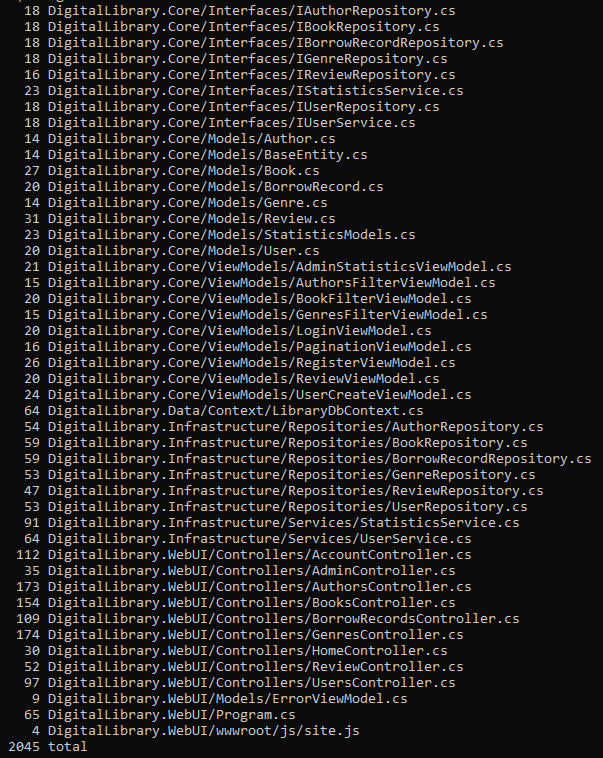

## DigitalLibrary
### Description of the project
DigitalLibrary.WebUI is a web application for an e-library built on ASP.NET Core MVC. The application allows users to register, browse books, genres, authors, create reviews, and administrators to manage users and content.
### Basic functionality
- Authentication and authorization of users with User and Admin roles (implemented in AccountController.cs)

- Browsing, searching, pagination of books and genres (BooksController.cs, GenresController.cs) 

- CRUD operations for genres, books, users (for the Admin role) — for example, GenresController.Create(), UsersController.Create() (UsersController.cs)

- Adding, removing reviews to books (ReviewController.cs) 

- Using roles to restrict access ([Authorize] attributes in controllers)

### Run locally
1. Clone the repository
2. Open the project in Visual Studio or VS Code
3. Edit the connection string in appsettings.json
4. Create a database and apply EF Core migrations (if needed)
5. Run the project

### Programming Principles

1. SRP (Single Responsibility Principle)
Each class has one responsibility
(BookRepository.cs — only access to book data)

2. OCP (Open/Closed Principle)
Modules are open to expansion, closed to changes
(Interfaces + DI: IUserRepository ↔ UserRepository)

3. LSP (Liskov Substitution Principle)
A descendant class can replace the base class
(All repositories implement the corresponding interfaces)

4. ISP (Interface Segregation Principle)
Separation of interfaces
(Different interfaces for UserService, ReviewService, etc.)

5. DIP (Dependency Inversion Principle)
Dependencies through abstractions
(DI via interfaces in controllers (UsersController.cs))

6. DRY (Don’t Repeat Yourself)
Avoiding code duplication
(Using PaginationViewModel in Books, Genres, etc.)

### Refactoring Techniques
1. Extract Method
Moving part of the logic into a method
(GenreController.Index → ​​filtering and pagination)

2. Introduce Parameter Object
ViewModels instead of long parameters
(ReviewViewModel.cs, UserCreateViewModel.cs)

3. Encapsulate Field
Because of the properties with hetaeras
(User.PasswordHash via service)

4. Replace Magic Number with Constant
For example, pageSize = 5
(GenreController.Index, BookController.Index)

5. Separate UI from Logic
MVC structure, ViewModels
(BookDetailsViewModel.cs, UserCreateViewModel.cs)

6. Use Dependency Injection
DI for services and repositories
(Via builder.Services.AddScoped<...> in Program.cs)

### Design Patterns

1. Repository
Abstracts the logic of database access
(IBookRepository, BookRepository (BookRepository.cs))

2. Dependency Injection
Decreased connectivity
(DI in UsersController, AccountController (Program.cs))

3. MVC (Model-View-Controller)
Architectural template
(The entire WebUI project: Models → Views → Controllers)

4. Unit of Work
Conservation coordination
(The LibraryDbContext aggregates all changes (LibraryDbContext.cs))

5. Factory Method
Creating a user with password hashing
(UserService.CreateUserAsync (UserService.cs))

### Authorization and roles
- HomeController allowed for all

- Controllers (Books, Genres, BorrowRecords) - for authorized

- Administration (UsersController, Create/Edit/Delete) - for Admin only

### Conclusions

The DigitalLibrary project demonstrates the implementation of a full-fledged multi-tier web system with a clear separation of responsibilities, using modern programming practices and architectural approaches.
The solution structure follows the principles of clean architecture: separate layers for models, data access, business logic, and UI. All project components adhere to the key SOLID principles, which ensures flexibility, scalability, and ease of maintenance.
Common design patterns (Repository, MVC, Dependency Injection) were applied, which allows you to effectively organize the code and reduce coupling between modules. Numerous refactoring techniques were implemented to make the code clean, understandable, and convenient for further development.
In addition, the system supports authentication, authorization with role-based access, and allows users to interact with content by creating book check-out records and adding reviews. All this makes the application not only technically competent, but also convenient and functional for the end user.

### Number of lines of code

